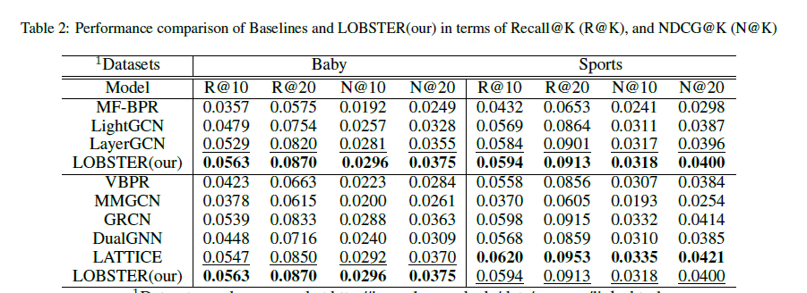

# LOBSTER: Bilateral Global Semantic Enhancement for Multimedia Recommendation

<!-- PROJECT LOGO -->

## Introduction

This is the Pytorch implementation for our LOBSTER paper:

>LOBSTER: Bilateral Global Semantic Enhancement for Multimedia Recommendation

## Enviroment Requirement
- python 3.9
- Pytorch 2.1.0

## Dataset

We provide three processed datasets: Baby, Sports.

Download from Google Drive: [Baby/Sports](https://drive.google.com/drive/folders/13cBy1EA_saTUuXxVllKgtfci2A09jyaG?usp=drive_link)

## Training
  ```
  cd ./src
  python main.py
  ```
## Performance Comparison


## Citing LOBSTER
If you find LOBSTER useful in your research, please consider citing our [paper]().
```

```
The code is released for academic research use only. For commercial use, please contact [Jinfeng Xu](jinfeng.xu0605@gmail.com).


## Acknowledgement
The structure of this code is  based on [MMRec](https://github.com/enoche/MMRec). Thank for their work.